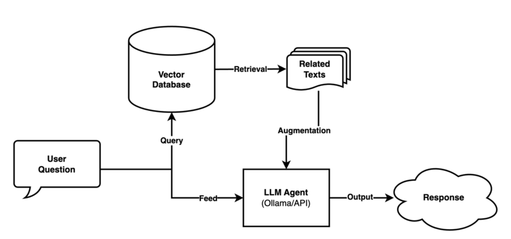

# Healthcare Chatbot: Multi-Dataset Medical Dialogue System

This project implements a medical chatbot powered by multiple datasets, integrating classification, question answering,
dialogue generation, and vector retrieval modules. It enables automated health Q&A, category prediction, and multi-turn
conversations in the healthcare domain. The overall pipeline is as follows:

---

## Table of Contents

- [Project Introduction](#project-introduction)
- [System Architecture](#system-architecture)
- [Datasets](#datasets)
- [Main Modules](#main-modules)
- [Model Performance](#model-performance)
- [Acknowledgements](#acknowledgements)

---

## Project Introduction

In recent years, chatbot technologies have emerged as one of the most transformative developments in human-computer
interaction, especially within the healthcare domain. As demand grows for round-the-clock, accessible health information
and the need to alleviate the burden on medical professionals, the market for healthcare chatbots is expanding
rapidly.  
This project aims to develop an intelligent dialogue system for medical consultation, leveraging the latest Natural
Language Processing (NLP) techniques to provide efficient and accurate health consultation and disease advice.

With the proliferation of health-related discussions across digital platforms (such as e-commerce reviews, specialized
health portals, and online communities), large volumes of unstructured medical conversation data are continuously
generated. These data sources offer rich opportunities but also bring challenges in semantic understanding and dialogue
coherence. Our solution integrates heterogeneous medical datasets to build a comprehensive knowledge base, focusing on
improving the chatbot’s accuracy, contextual understanding, and multi-turn conversation capability—offering smart health
Q&A and decision support for users and healthcare professionals.

---

## System Architecture

### Pipeline Overview

As shown above, the system is divided into data collection & preprocessing, statistical analysis, predictive
modeling, next-question prediction, vector database construction, and final output modules. All components can be
seamlessly integrated into a dashboard-driven user interface.

### Agent Workflow

As shown above, user queries are first matched against a vector database to retrieve relevant texts, which
then augment the input to the LLM agent (e.g., via Ollama or API), producing the final response.

---

## Datasets

This project uses three main medical dialogue datasets:

### 1. Healthcare Consults

- Approximately 100 manually curated health consultation utterances
- Used for model fine-tuning and category analysis
- The following table shows the number and percentage distribution of samples in each category before and after
  augmentation:

|         Label & Category         | Before Augmentation | After Augmentation |
|:--------------------------------:|:-------------------:|:------------------:|
|  Label 2 (symptom-description)   |     39 (43.33%)     |    117 (43.33%)    |
|   Label 1 (insurance-related)    |      8 (8.89%)      |     24 (8.89%)     |
|    Label 4 (vaccine-related)     |     10 (11.11%)     |    30 (11.11%)     |
| Label 0 (medication-side-effect) |     23 (25.56%)     |    69 (25.56%)     |
|   Label 3 (pharmaceutical-use)   |     10 (11.11%)     |    30 (11.11%)     |

### 2. DX Dataset

|   Characteristic   | Value |
|:------------------:|:-----:|
|  Total dialogues   |  527  |
| Disease categories |   5   |
| Avg turns/dialogue |  8.6  |
| Explicit symptoms  |  41   |
| Implicit symptoms  |  23   |
| Training set size  |  423  |
|   Test set size    |  104  |

### 3. MedDG Dataset

|     Characteristic      |      Value       |
|:-----------------------:|:----------------:|
|     Total dialogues     |      17,864      |
|    Total utterances     |     385,951      |
| Avg utterances/dialogue |       21.6       |
|    Medical specialty    | Gastroenterology |
|   Min utterances/case   |        10        |
|   Max utterances/case   |        50        |

---

## Main Modules

- **Data Screening & Analysis:** Category statistics, answer length distribution, etc.
- **Category Classifier:** Based on TF-IDF/Logistic Regression or BERT-family models
- **Automated Q&A and Next-Question Prediction:** Deep learning models such as Seq2Seq
- **Text Summarization & Keyword Extraction:** For efficient retrieval and topic abstraction
- **Vector Database (e.g., Milvus):** For high-efficiency semantic similarity search
- **LLM Agent:** Utilizes Ollama or API for intelligent, augmented conversation

---

## Model Performance

### Consultation Category Classifier Results

**On the non-augmented dataset:**

|          Model          | Best Train Accuracy | Best Test Accuracy |
|:-----------------------:|:-------------------:|:------------------:|
|      roberta-base       |       0.8935        |       0.9444       |
| distilbert-base-uncased |       0.9907        |       0.9815       |

**On the augmented dataset:**

|          Model          | Best Train Accuracy | Best Test Accuracy |
|:-----------------------:|:-------------------:|:------------------:|
|      roberta-base       |       0.8889        |       0.8889       |
| distilbert-base-uncased |       0.9861        |       0.8333       |

---

## Acknowledgements

- This project references and uses open medical dialogue datasets such as DX and MedDG.
- Thanks to the open-source community for tools and frameworks like Huggingface, Milvus, and Ollama.

---